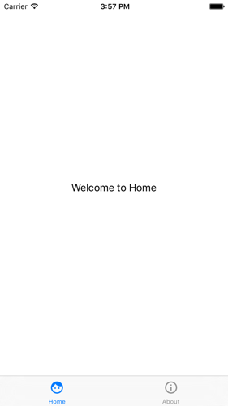

# Xamarin samples

# Bottom navigation bar

By default on Xamarin Forms, TabbedPage are displayed on the bottom and with and on iOS, and on the top with just a text on Android.

This samples demonstrates how to use the BottomNavigationBar control on Android to mimic iOS functionality with Xamarin Forms and a custom renderer.

# Screenshots

# Resources
The original source code of the custom renderer was found here (https://github.com/khle/DayOneXF)[https://github.com/khle/DayOneXF]

Thanks to Kevin H Le !
